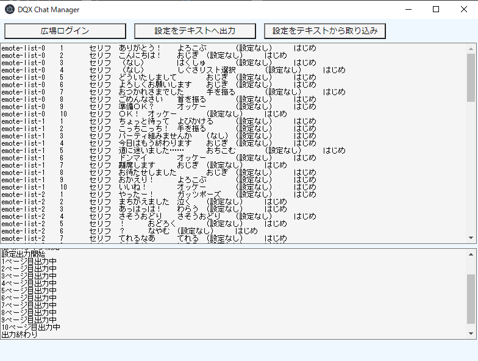
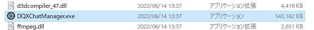
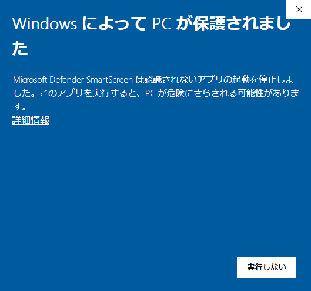
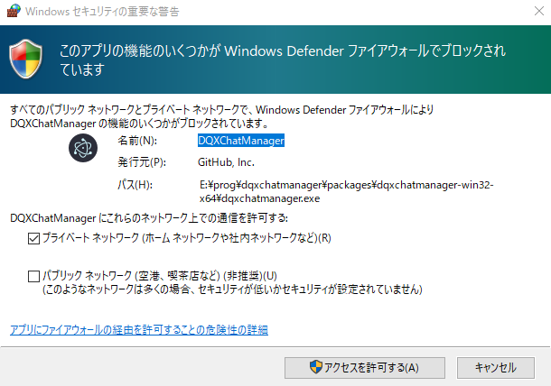
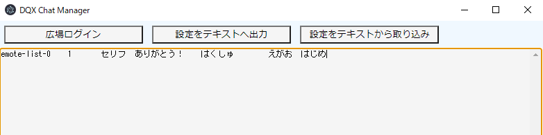
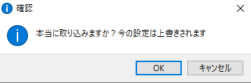
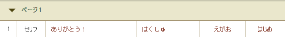
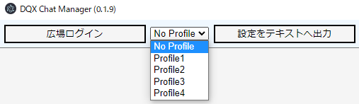

# DQXChatManager

## はじめに

-   DQX のよく使うセリフを管理するアプリです
-   現在の設定を PC へ保存したり、保存した状態を復元できます
-   [Edge](https://www.microsoft.com/ja-jp/edge)がインストールされた Windows PC が必要です（普通は入っていると思います）
-   Mac/スマホなどでは動作しません
-   このページの内容をよく読み理解できる方のみ使用願います



## 機能

-   現在のよく使うセリフの設定をテキストへ出力する
-   テキストの内容をもとに、アプリがブラウザを操作してよく使うセリフを設定する

## ダウンロード

[ダウンロード](https://github.com/tubame0505/DQXChatManager/releases/download/v0.1.13/DQXChatManager-win32-x64.zip)  
ダウンロードした ZIP ファイルを展開して、中の DQXChatManager.exe を実行してください



### Windows によって PC が保護されましたという表示が出た場合



ZIP ファイルの展開の仕方によって出る場合があります  
リンク先の画面を参考に、「詳細情報」→「実行」と操作してください  
[操作方法（Buffalo 社サイトへリンク）](https://www.buffalo.jp/support/faq/detail/124145337.html)

## 使い方（設定出力）

-   初回起動時に画像のような画面が出るので ✕ で消すかキャンセルしてください。許可を押す必要はありません。

    

-   「広場ログイン」ボタン押すとブラウザが立ち上がるのでログインしてください。よく使うセリフのページが表示されるはずです
-   「設定をテキストへ出力」ボタン押すとテキストボックスに設定が書き出されるので、メモ帳アプリ等へ保存しておいてください（テキスト選択後 CTRL+C でコピーできます）

## 使い方（取り込みテスト）

-   まず動作チェックをしてください
-   この後の操作をすると、よく使うセリフ１ページ目の先頭が書き換わります
-   テキストボックスに下の文字を正確にコピペしてください（CTRL+C でコピー、CTRL+V で貼り付け）

```
emote-list-0	1	セリフ	ありがとう！	はくしゅ	えがお	はじめ
```



-   「設定をテキストから取り込み」ボタンを押すと確認画面が出て OK を押すとアプリがブラウザを操作して設定を書き込みます  
    
-   １ページ目の先頭が変わっていたら成功です  
    

## 使い方（取り込み）

-   「広場ログイン」後に、保存しておいた設定テキストをテキストボックスに貼り付けて「設定をテキストから取り込み」ボタンを押すと、アプリがブラウザを操作して設定を書き込みます
-   今の設定が上書きされてしまうので注意
-   設定中の中断はできません。動きがおかしいなと思ったら、ブラウザを ✕ ボタンで閉じてください
-   設定の不要な行を削除しておくと早く終わります
-   他のキャラクターへの設定引っ越しなどもできるかと思いますが、動作は未確認です

## 使い方（ユーザプロファイル）

-   広場のログイン状態を保存する機能を追加しました  
    

-   No Profile はログイン状態は保存されません、毎回 ID とパスワードを入れる必要があります（従来どおりの動作）
-   Profile1 ～ 4 を選択するとそれぞれ別のログイン状態が保存されますので、アカウントやキャラクター等で使い分けることができます
-   <span style="color: red; ">[注意]</span> ログイン状態はファイルに保存されているので、複数人が使用するパソコンでの利用はお控えください。
-   万が一保存してしまった場合は削除してください。保存ファイルの場所は"resources\app\dist\profiles"になります。
-   よくわからない場合は DQXChatManager があるフォルダごと削除してください。

## 使い方　[(スプレッドシートを使った編集)](./spread-sheets.md)

## 注意事項

-   広場の仕様変更、ブラウザの更新などで急に動作しなくなる場合があります
-   Edge のアップデート直後はうまく動作しない場合があります
-   不具合などのサポートは基本的には致しません
-   アプリが制御しているブラウザへのログイン ID やパスの入力が心配であればワンタイムパスワードを設定しておいてください
-   このアプリによるブラウザ操作は[スクウェア・エニックス アカウント規約](https://support.jp.square-enix.com/rule.php?id=450&la=0&tag=sqexaccount)「第 15 条　禁止行為 (24)」に違反するものではないと考えていますが、不安な方は利用をお控えください
    > 第 15 条　禁止行為  
    > (24) 自動的に特定の行為を繰り返させるプログラムやツールを用いて対象サービスの各コンテンツや各サービス（コミュニティを含む）を利用する行為。

## 更新履歴

-   v0.1.5: ブラウザ画面でセリフの設定 UI が畳まれているときに動作しない不具合を修正
-   v0.1.6: 一部のしぐさが正しく設定されない不具合を修正
-   v0.1.7: 取り込み時ランダムにエラーが出る不具合を修正
-   v0.1.8: 取り込みエラー時リトライをする機能を追加
-   v0.1.9: ユーザプロファイルを保存する機能を追加
-   v0.1.10: だいじなもの/その他アイテムに対応　変更が不要な項目はスキップするように動作変更
-   v0.1.11: リトライ時に広場ページを再読込する動作に変更
-   v0.1.12: リトライ時のエラーを改善
-   v0.1.13: Edge ブラウザの起動サイズ変更
