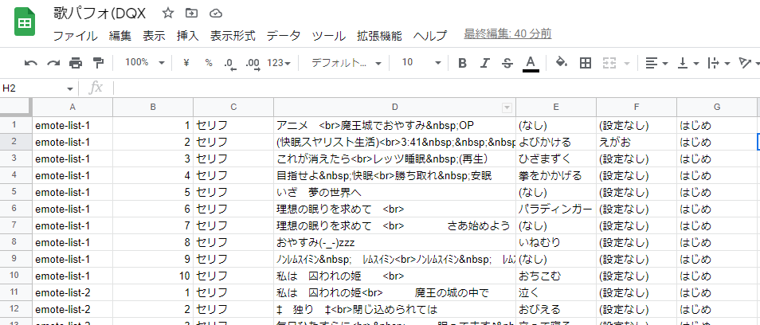
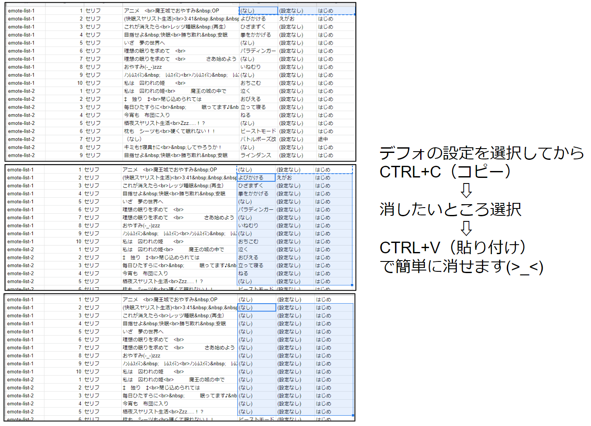
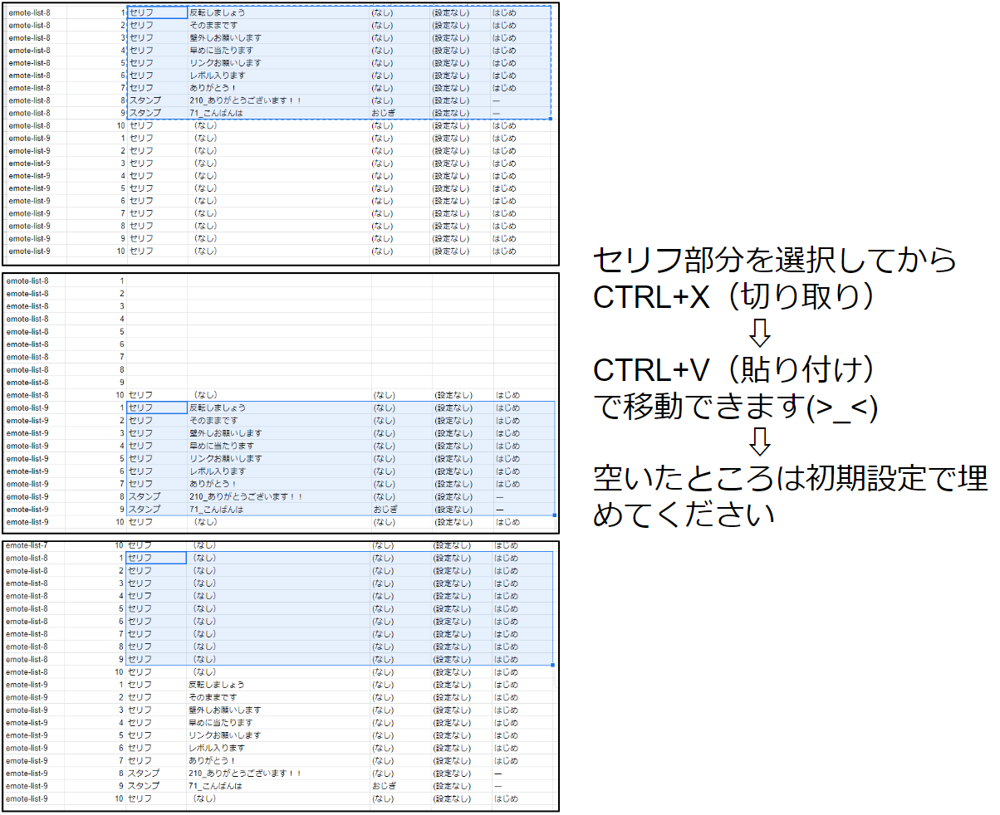

## 使い方（スプレッドシートでの利用）

-   Excel や[Google sheets](https://www.google.com/intl/ja_jp/sheets/about/)に貼り付けて編集ができます
-   ゲーム内でやると面倒な編集が簡単にできます

    

## しぐさなどを一気に削除

-   コピペ作業でしぐさを一気に消せます

    

## 位置の移動

-   シートの上でのコピペ作業でセリフの位置修正や１～２行の隙間を開けることができます

    

## セリフ内容

-   セリフ内容は一部の文字が記号になってしまうのと 20 文字制限の確認ができないので、インゲームでやったほうが良いかと思います
-   文字と記号の対応表

| 文字       | 記号    |
| ---------- | ------- |
| 改行       | \<br\>  |
| 半角の空白 | \&nbsp; |
| &          | \&amp;  |
| <          | \&lt;   |
| >          | \&gt;   |
